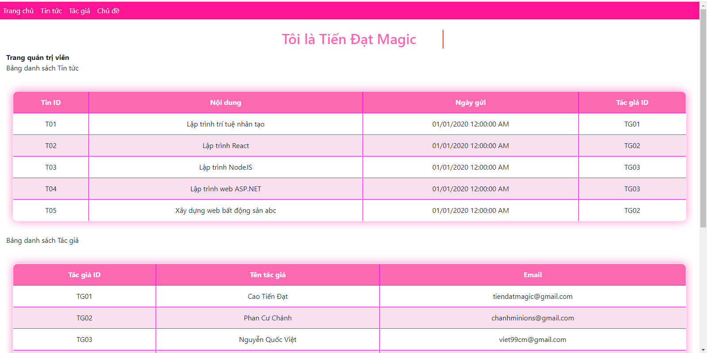
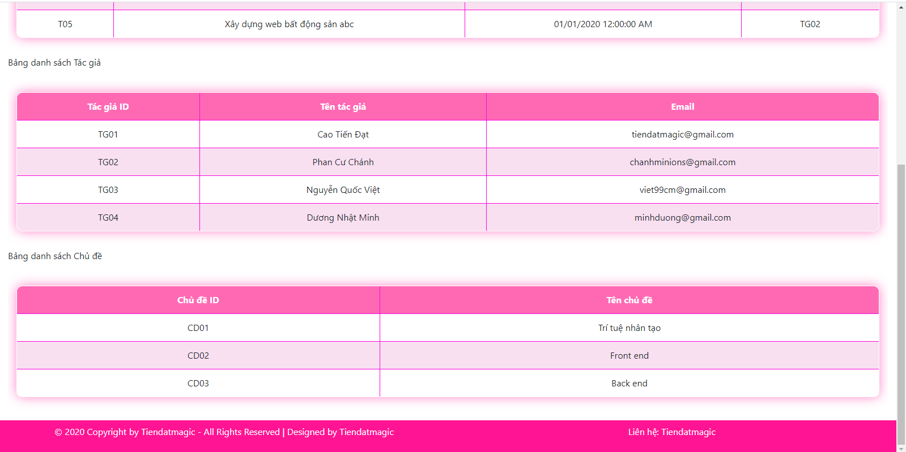
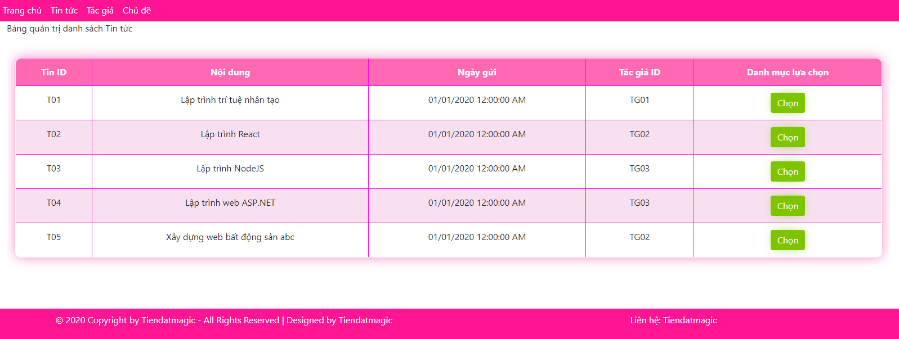
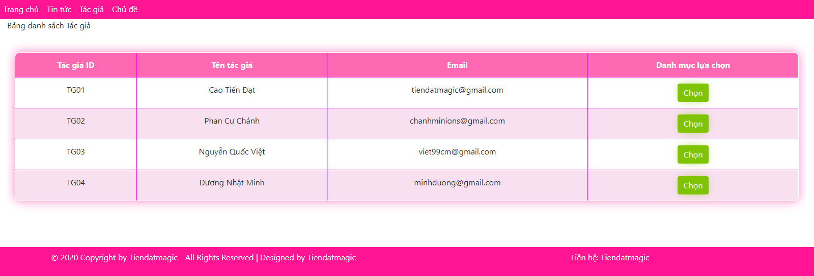
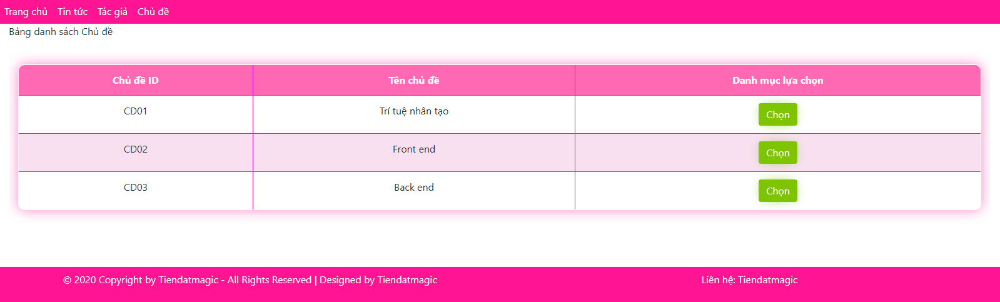
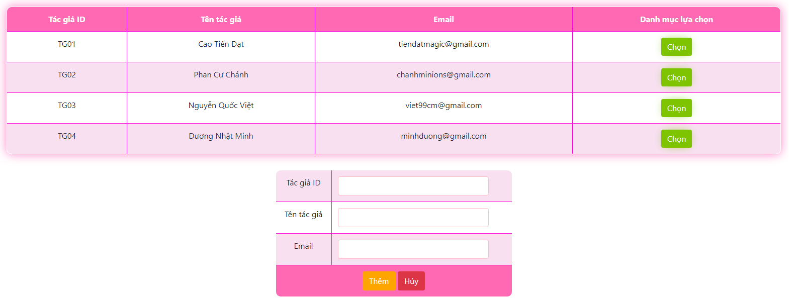
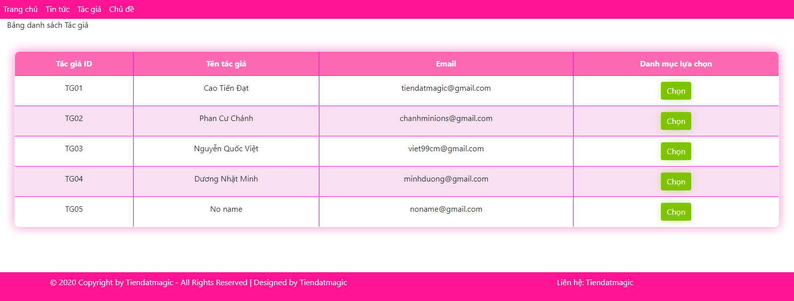
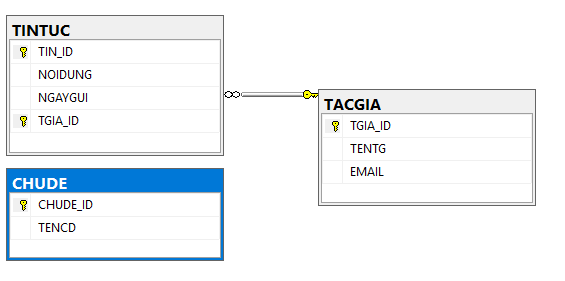

# Thi kết thúc môn Xây dựng website thương mại
- Họ và Tên: Cao Tiến Đạt
- Lớp: CTT12CĐ3A
- Thi môn: Thi kết thúc môn Xây dựng website thương mại
- Ngày: 28/12/2020

## Giới thiệu sơ lược về website ##
Quản lý danh sách các bảng TIN TUC, TAC GIA, CHU DE

### Trang chủ ###

Hiển thị danh sách thống kê tất cả các bảng

Giao diện trang tin tức

Giao diện trang tác giả

Giao diện trang chủ đề

Khi muốn thực hiện các tác vụ như thêm, sửa hoặc xóa, ta bấm chọn vào bất kỳ đối tượng nào của bảng

Tại đây ta có thể thực hiện tùy ý, nếu ta muốn thêm mới dữ liệu trong bảng chọn Mới

Ta nhập dữ liệu mới vào phù hợp với điều kiện ràng buộc trong cơ sở dữ liệu, và ấn vào nút Thêm

Dữ liệu mới được thêm vào thành công

Mối quan hệ giữa các bảng trong cơ sở dữ liệu

